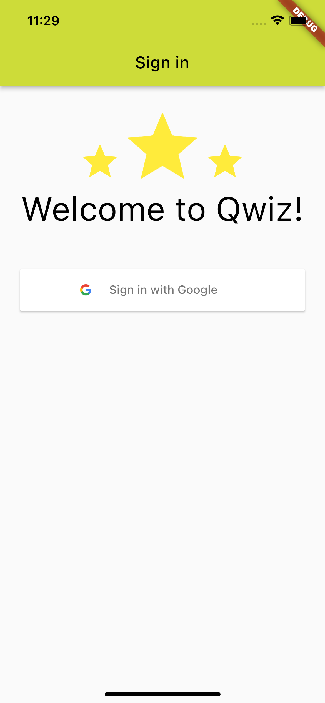
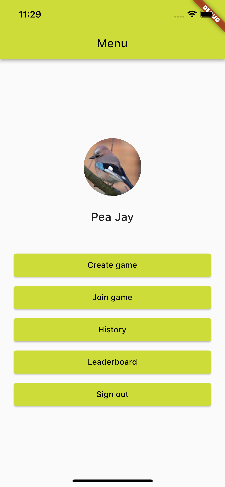
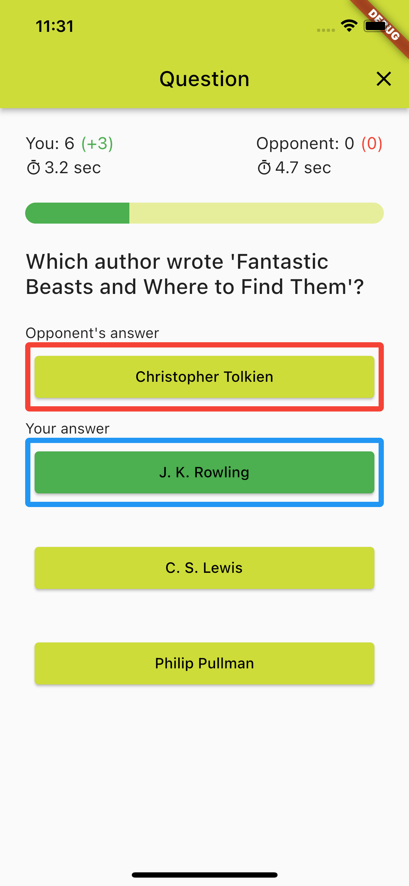
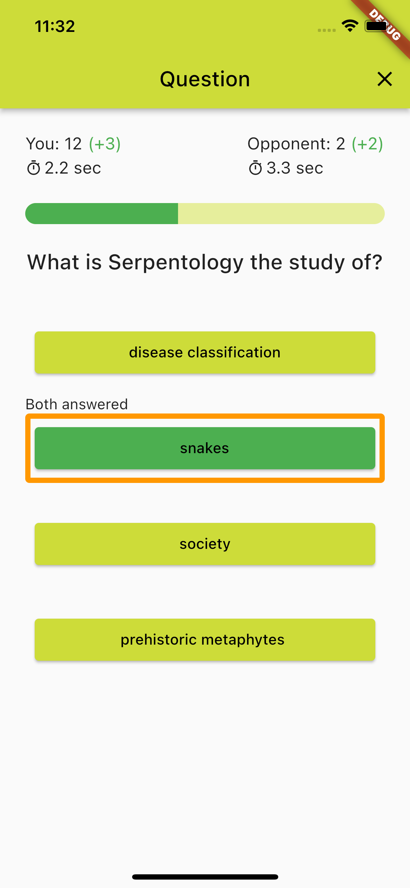
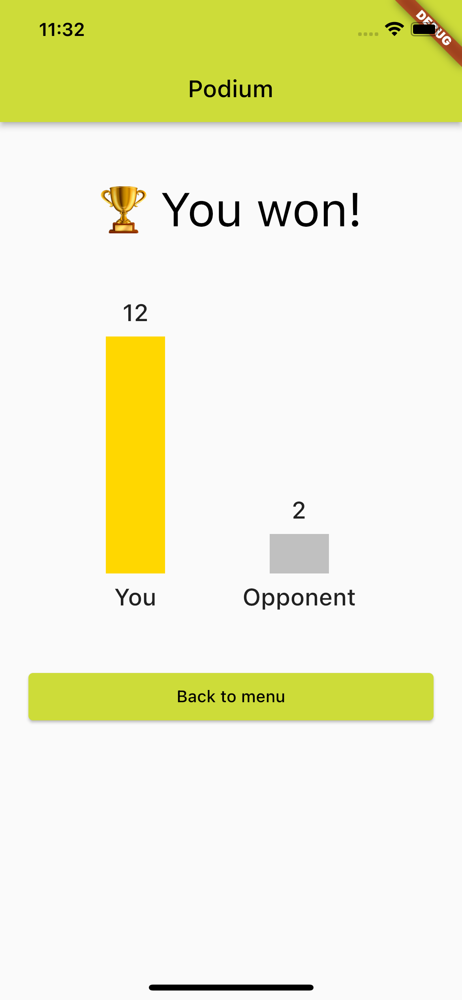
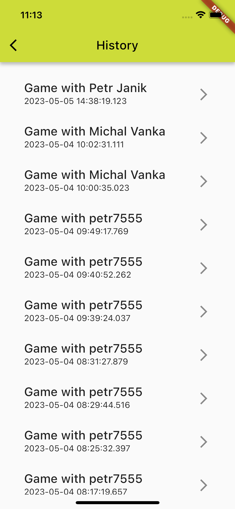
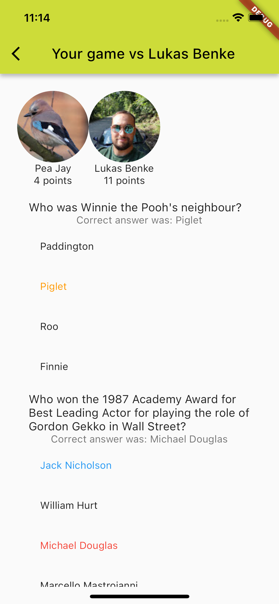
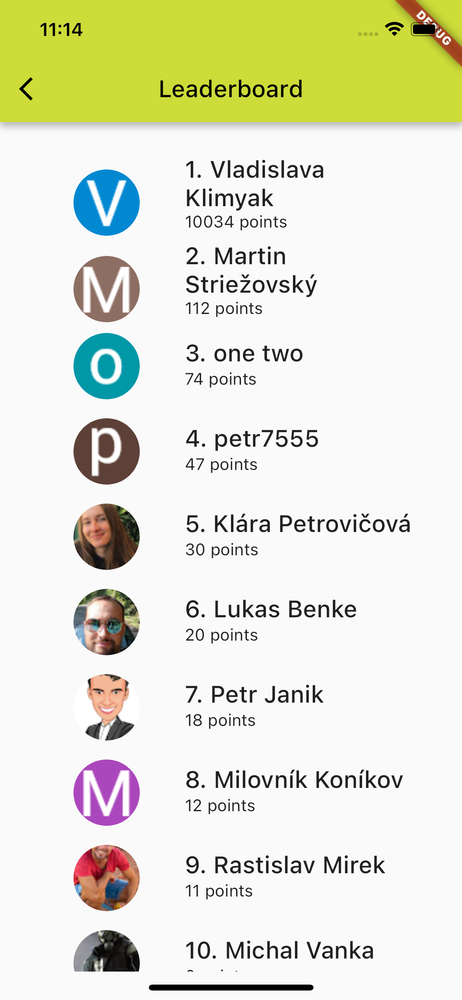

# Qwiz

Petr Janík, Martin Striežovský, 2023

---

# Introduction

- 
- Available on **Web**, **Android** and **iOS**

---

# Demo

---

# Screenshots

---

---

---

---

---

# Technical challenges & solutions

- Authentication
- Declarative & persistent routing
- "Server-less" clients synchronization

---

# Thank you

Try it out: https://pv239-qwiz.web.app/
Code: https://github.com/petr7555/pv239_qwiz
