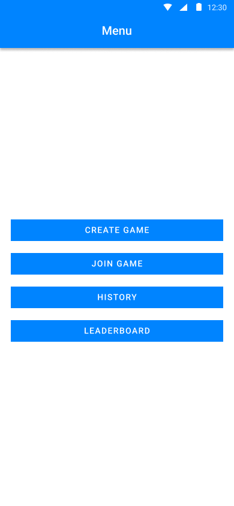
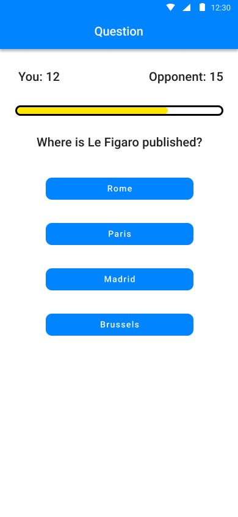
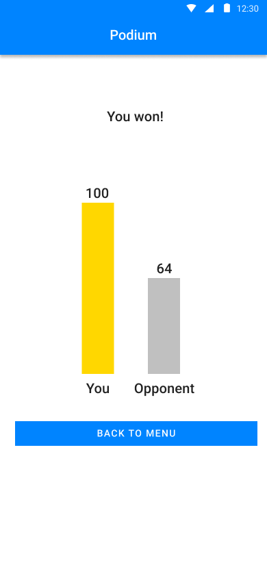
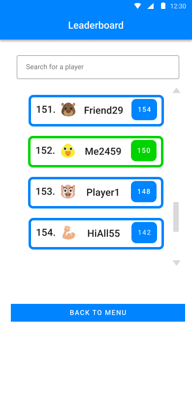

# Qwiz

> 🤓 Get your brain in the game with Qwiz - the ultimate trivia experience! 🧠

## Team 👨‍💻👨‍💻

- Petr Janík (485122)
- Martin Striežovský (485213)

## Technology

Flutter

## Description:

_**Qwiz**_ is a knowledge game for 2 players, each playing on their mobile.
Both players sign in using Google authentication (**sign in** screen),
and then they are redirected to the **menu**.
One player creates a new game (**create game** screen). Here a number of points required to win
is set.
Then the player moves to the **lobby** where a code for the other player is displayed.
The second player joins the game on their mobile using the code (**join game** screen).
After 3 seconds (**get ready** screen), the game starts.

Both players are presented with a question and 4 possible answers (**question** screen).
The question is taken from a public API and is the same for both players.
They are both answering at the same time. There is a timeout of 10 seconds for the question
visualized by a progress bar (spec. change: the timeout is based on question and answers length).
If they both answer, the timeout ends immediately.
If they both answer correctly, the one who answered sooner gets 3 points,
the other one gets 2 points. If they both answer at the same time, they get both 2 points.
If only one of them answered correctly, they get 3 points. If no player answered correctly,
no points are given. There are no negative points. The players might not answer at all.
After each question, users can see the correct answer, their and opponent's answer, total score,
score gain / loss and answer time (**question results** screen).
If they have the same score, a shootout question follows.
Whoever answers second / wrong loses 1 point. There are no positive points given.
The minimal score at any time is 0.
When one of the players reaches the set number of points, they win. The **podium** screen is shown.

Players can see a history of games they participated in (**history** screen).
The history is sorted by date; the most recent game is at the top.
For each game in the history (**game info** screen), they see their score, the score of their
opponent and the winner.
They can also see the questions with the options, the correct answer, their answer and the
opponent's answer. 

There will be a leaderboard of all players (**leaderboard** screen) sorted by the total number of
points obtained in all games. The player can see their position in the leaderboard and the number of
points they have. Each user has a profile picture and a name. These are taken from the Google
account they've signed in with.

## Networking:

- Firebase
- [Questions API](https://the-trivia-api.com/)

## Screen mockups:
[Figma](https://www.figma.com/file/iLdJoL8HLbfUiAXcNTFrjl/PV239-Qwiz?node-id=12%3A1422&t=XYDPNrb7i7xGGlsS-1)

  
  &nbsp; &nbsp; &nbsp; &nbsp;
  
  &nbsp; &nbsp; &nbsp; &nbsp;
  

  
  &nbsp; &nbsp; &nbsp; &nbsp;
  
  &nbsp; &nbsp; &nbsp; &nbsp;
  

